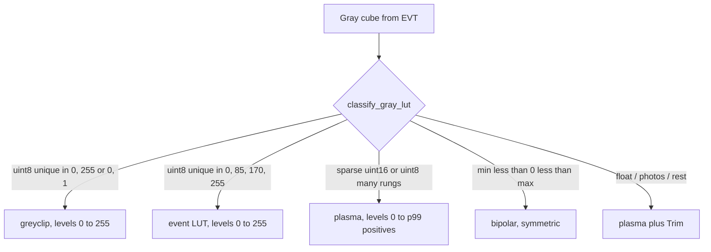

# Exotic formats and the standard loader

BLITZ’s **standard loader** (Flatpak / EXE) focuses on:

- Images, video, `.npy`
- ASCII grids (`.asc` / `.dat` / probed `.txt`)
- In-core HIKMICRO radiometric JPEG → approximate °C (numpy only)
- Folder chooser when a directory contains mixed groups

## What stays out of the core

Domain / exotic formats (historical DICOM path, OMERO, Bio-Formats, …) are **not**
embedded in the Flatpak/EXE. That keeps the artifact lean and avoids optional
heavy dependencies.

## Later bridges (policy)

When BLITZ should “handle more formats” without bloating the core:

1. **Standalone converter** — CLI/toolbox (same idea as suite `converters/`) that
   writes `.npy` (or plain images). User opens the result in BLITZ.
2. **Mini-server** — convert remotely; BLITZ only receives standard payloads
   (aligned with WOLKE → viewer `.npy` delivery).

### EVT3 event cameras (IDS / Prophesee)

**Event reader** (`../EVT/`, working title) is the exotic path for EVT3 `.raw`
archives: decode once, re-bin with live Δt / polarity / window, and push stacks
to BLITZ over the **WOLKE** Socket.IO + HTTP `.npy` contract. Not embedded in
the BLITZ Flatpak. A later live/multi-cam streamer (**FUNKE**) is backlog only.

**Event cube:** the sidecar **Send as** is one of:

- **states** (default) — one `uint8` channel, four even rungs: 0 = nothing,
  85 = OFF, 170 = ON, 255 = both. Auto uses **`event`** (black → red → green
  → yellow) pinned 0…255. Any other colormap works on the same rungs.
- **counts** — `uint16` gray events/pixel/Δt (activity `ON+OFF` when polarity
  is color). Auto uses **plasma**, levels 0…p99 of positives.
- **occupancy** — `uint8` gray binary 0/255. Auto uses **greyclip**, levels
  0…255 (or 0…1).

Signed / ON-only / OFF-only are gray views of the same planes (counts or
occupancy). Stream ingest does **not** apply File-tab 8-bit / grayscale
(8-bit would zero uint16 counts).

### DGM / GeoTIFF tiles (LGL)

Do **not** mosaic in the BLITZ folder loader (that would stack tiles as `T`).
Use the suite sidecar `../converters/dgm_mosaic/` (`uv run dgm-mosaic`):
OpenCV + world file / `dgm025_32_{e}_{n}` names, then **Send to BLITZ** over
the same Socket.IO + HTTP `.npy` contract as the Event reader (not WOLKE, not
a live tile stream). GUI preview is one mosaic (0…1 stretch, blue–white–red);
drag a rectangle of tiles to export (holes in the box are 0). Optional disk
`.npy`. GeoTIFF stays out of the Flatpak; GDAL is not required. Stream address
`http://127.0.0.1:5056`, token `dgm`.

Do **not** grow the core Flatpak with exotic native deps unless a format is
numpy/cv2-only and clearly belongs in the standard loader (like HIKMICRO).
