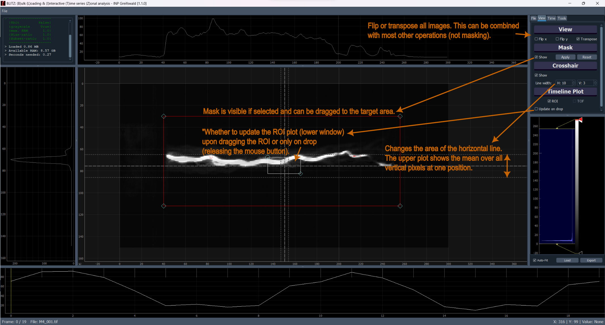
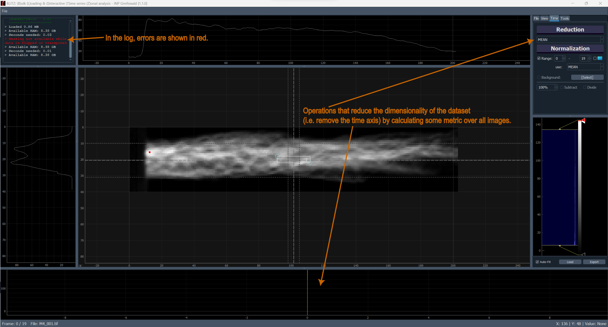

# **BLITZ** Walkthrough

The images below show a basic example of using the program with an example image dataset.

### File loading and GUI

First, load an image dataset. This can be done either by pressing the `Open File` or `Open Folder`
button or dropping a file or folder on the center part of the application. Images are either loaded
in grayscale or with colors. You can force to load a dataset in grayscale by clicking the
corresponding checkbox in the `Loading` section.

- If a folder is loaded, **BLITZ** checks all files inside and loads the ones with the most
  frequent suffix that appears.
- If an `.npy` file is loaded, the array can be of shape `(N, m, n)`, `(m, n)` or `(N, m, n, 3)`
  for color images, where `N` is the number of images and `m, n` is the shape (number of pixels) of
  the image. The checkbox _grayscale_ influences the way an array with 3 dimensions is loaded.
- If a video file gets loaded, **BLITZ** decides at which frequency to extract images, based on the
  given parameters _8bit_, _Subset ratio_, _Size ratio_ and _Max. RAM_.

Once a dataset is loaded, there are a number of metrics and information on the data directly
visible:

### Manipulations and Masking

The _View_ operation set provides functions on changing the size or view of the image.

### Reduction

We call data manipulations along the time axis `Reduction` operations. This can be for example
computing the mean, maximum or minimum value of each single pixel accross all images.

### Normalization

Normalization subtracts or divides each image pixel by a certain value. This value often is chosen
to be the mean of a certain subset of images.

### Tools

If the actual size of an object in an image is known, the measuring tool can be used to measure
distances in millimeters or angles in degrees.

### Color table

For grayscale images, it is often useful to change the colortable to enhance visibility of
low-value pixels (e.g. parts of the image that aren't enough lit-up).

